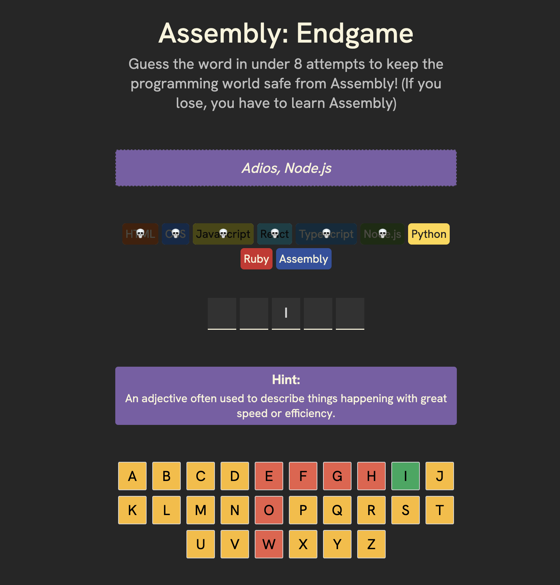
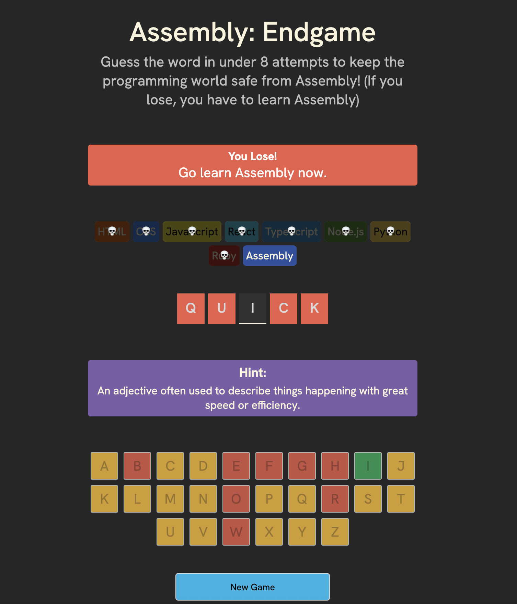
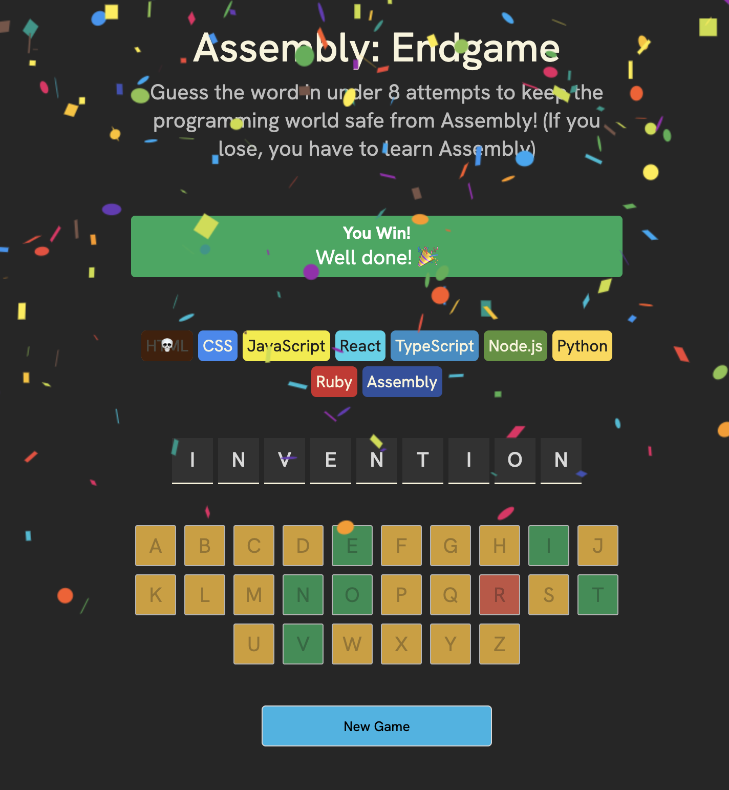

Assembly Endgame is a word-guessing game with a programming twist. Players try to guess a mystery programming-related word by clicking letter buttons. Correct guesses reveal letters in their positions, while wrong guesses cause programming languages to "die" and disappear from the world. Players must solve the word before losing all 8+ programming languages to Assembly's takeover. The game features dynamic visual feedback, conditional styling for game states (winning, losing, in-progress), and randomly selected words for replayability.

